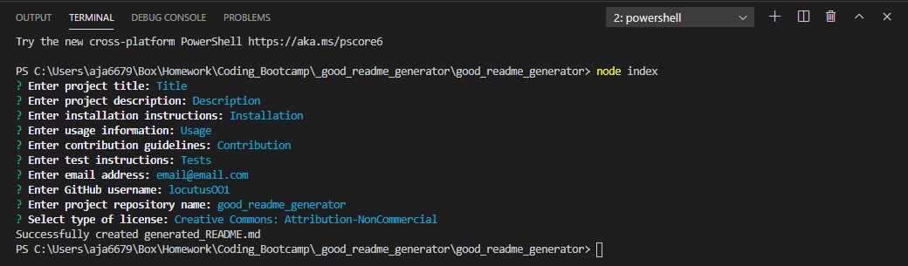
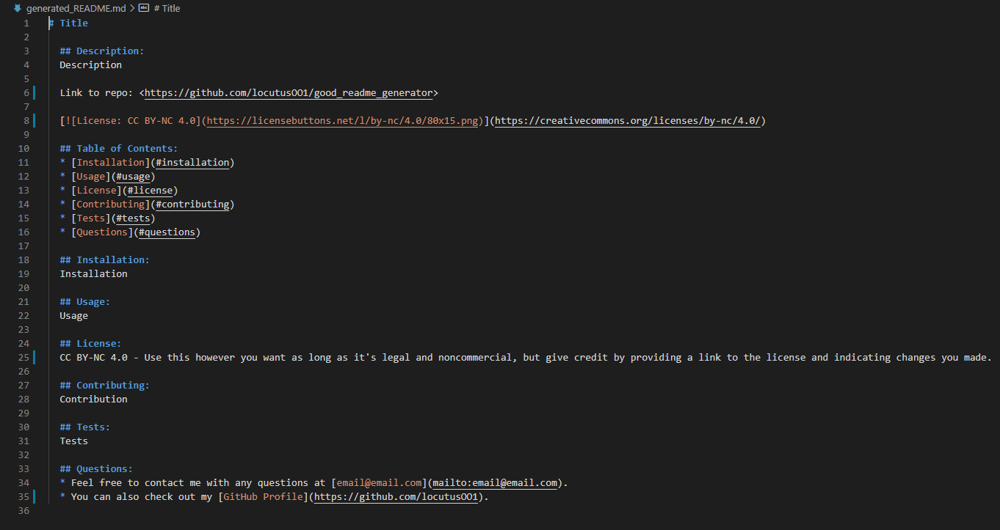

# Good README Generator

  ## Description:
  This program uses JavaScript to generate a nicely formatted README file which incorporates user prompted information.

  ## Links:
  * [Repo](https://github.com/locutusOO1/good_readme_generator)
  * [Video Walkthrough](https://drive.google.com/file/d/1ci59lY1w9MzFGfAccvoMVEioC6PY7eNh/view)

  ## Table of Contents:
  1. [Installation](#installation)
  2. [Usage](#usage)
  3. [Technology Used](#technology-used)
  5. [Questions](#questions)
  6. [Screenshots](#screenshots)

  ## Installation:
  * Install dependencies by running "npm install" from the terminal.
  
  ## Usage:
  * Run from the terminal with "node index"
  * Follow instructions from prompts to enter information for the README
  * If successful, a new README file is created as "generated_README.md"

  ## Technology Used:
  * Node.js - for JS runtime environment
  * JS/ES6+ - for program logic
  * Markdown - for README style and functionality
  * Inquirer - for user input with prompts
  * File Sytem - for file creation

  ## Questions:
  * Feel free to checkout my [GitHub Profile](https://github.com/locutusOO1).

  ## Screenshots:
  CLI Example:
  
  README Example:
  
